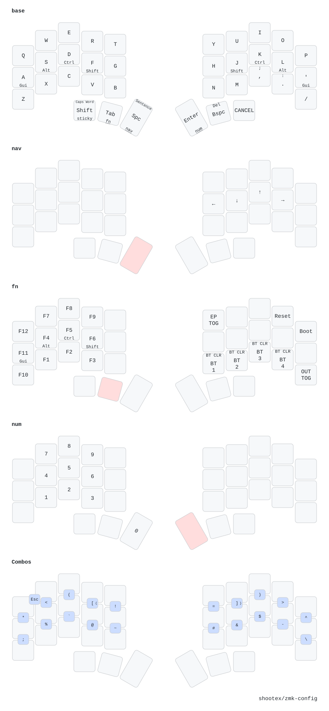

# My zmk-config (based on urob)

This is my personal [ZMK firmware](https://github.com/zmkfirmware/zmk/)
configuration, based on [urob's zmk-config](https://github.com/urob/zmk-config).

See the [upstream readme](https://github.com/urob/zmk-config) for documentation on features and setup.